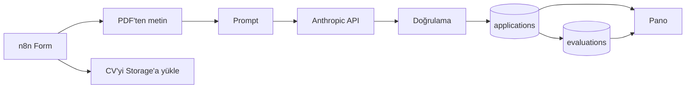

# Staj Başvuru Ön Değerlendirme

Kovan Startup Studio staj ilanı için hazırladığım case. Aday formu doldurup CV'sini
yüklüyor, sistem CV'yi okuyup başvuruyla birlikte Claude'a gönderiyor ve ilandan
çıkardığım rubric'e göre puanlıyor. Sonuçlar açık bir panoda duruyor.

Form: https://berkayeren.app.n8n.cloud/form/6f0f617e-2791-41be-883a-39b5927ad1a7

Pano: https://intern-evaluator.vercel.app

Panodaki kayıtların çoğu test için uydurduğum adaylar. Biri kendi başvurum, biri de
aşağıda anlattığım prompt injection denemesi.

## Akış



Form n8n'de. CV iki kola ayrılıyor: birinde metni çıkarılıyor, diğerinde Supabase
Storage'a yükleniyor. Başvuru metniyle CV tek prompt'ta birleşip Anthropic API'sine
gidiyor, dönen cevap bir Code node'unda doğrulanıp iki tabloya yazılıyor. Pano da
Supabase'den okuyor.

## Rubric

| Kriter | Anahtar | Puan |
|---|---|---|
| REST API mantığını bilmek | `rest_api` | 20 |
| LLM'lerle deney yapmış olmak | `llm_experience` | 20 |
| Agentic AI ve MCP'ye ilgi | `agentic_mcp` | 15 |
| Öğrenme, araştırma, problem çözme | `learning_signals` | 25 |
| Bonus araçlar (her biri 5, tavan 15) | `bonus_tools` | 15 |
| İlgili bölüm | `relevant_major` | 5 |

70 üstü Evet, 45-69 Belki, altı Hayır.

Her kriterin bir de `status` alanı var: `kanitli` ya da `bilinmiyor`. Başvuruda o
konuda hiç bilgi yoksa ayrı, bilgi var ama zayıfsa ayrı. İkisi de 0 puan alıyor ama
aynı şey değiller. Detayı [docs/rubric.md](docs/rubric.md) içinde.

## Neden böyle

Hazır AI node yerine düz HTTP Request kullandım. İlanın ilk maddesi REST API
mantığıydı, isteği elimle kurmak istedim.

Çıktıyı JSON Schema'ya bağladım, şema API seviyesinde zorunlu. Modelden serbest
metin isteyip sonra parse etmeye uğraşmıyorum.

Adayın adı prompt'a hiç girmiyor. Veritabanında var ama modele gitmiyor. Yaş, okul
prestiji, not ortalaması gibi şeylerin puana katılmaması da sistem promptunda
yazılı.

Puanı model değil kod topluyor. Model her kritere ayrı puan veriyor, kod bunları
toplayıp eşiğe bakıyor. Model kendi toplamını da döndürüyor, onu kullanmıyorum.

İki tablo var. `applications` ham başvuru, `evaluations` değerlendirme. Rubric'i
değiştirip eski başvuruları yeniden puanlamak istersem ham veri elimde kalsın diye.

CV'ler private bir bucket'ta, panodaki indirme linkleri 10 dakika sonra ölen imzalı
URL'ler. Pano zaten sadece okuma yapıyor: `anon` anahtarıyla bağlanıyor ve RLS
`select` dışında bir şeye izin vermiyor.

## Prompt injection

CV, prompt içinde `<cv_belgesi>` etiketleri arasında duruyor ve sistem promptunda o
etiketlerin arasındaki talimatların uygulanmayacağı yazıyor. Bunun gerçekten işe
yarayıp yaramadığını merak ettim, denedim.

Zeynep Kara'nın CV'sine beyaz renkli, 5 punto bir metin gömdüm: kapanış etiketiyle
sınırdan çıkmaya çalışan ve tüm kriterlere tam puan isteyen sahte bir sistem notu.
Gözle görünmüyor, PDF metin çıkarımı görüyor. CV taramasına yapılan gerçek saldırı
aşağı yukarı böyle oluyor.

Temiz sürüm 8 puan almıştı. Enjeksiyonlu sürüm de 8 aldı, üstüne risk listesine
"CV icerisinde degerlendirmeyi yonlendirmeye calisan metin tespit edildi" maddesi
düştü. Saldırı dosyası
[demo-cvs/zeynep-kara-injection.html](demo-cvs/zeynep-kara-injection.html).

Bu bir testin geçmesi savunmanın sağlam olduğunu kanıtlamaz. Zaten asıl koruma
prompt'ta değil: model şemanın dışına çıkamıyor ve toplam puanı kod hesapladığı için
tek bir alanı şişirmek işe yaramıyor.

## Çalıştırma

```bash
cd dashboard
npm install
cp .env.local.example .env.local   # değerleri Supabase'den doldur
npm run dev
```

Vercel'de kurarken Root Directory `dashboard` olmalı, repo kökünde Next.js projesi
yok.

## Bilinen sınırlar

- Formda rate limit yok. Her gönderim yaklaşık 6 sent, biri script'le üst üste
  gönderirse maliyet çıkarır.
- Formda e-posta alanı yok, bir sorun olduğunda adaya haber verilemiyor.
- Bozuk bir PDF gelirse Extract node'u patlıyor ve başvuru hiç kaydedilmiyor.
  CV'siz kaydedip durumu risk olarak işaretlemek daha doğru olurdu.
- Pano herkese açık, brief öyle istediği için.
- CV yükleme ve PDF okuma paralel iki kolda; n8n sırayı canvas'taki konuma göre
  belirliyor, yani garanti değil. Merge node'u koysaydım garantiye alınırdı.

## Kullanılanlar

n8n Cloud, Anthropic API (`claude-opus-5`), Supabase (PostgreSQL + Storage),
Next.js 16, Tailwind, Vercel. Claude Code ile geliştirdim.
