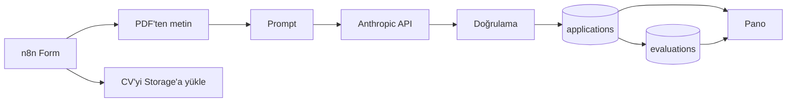

# Staj Başvuru Ön Değerlendirme

Kovan Startup Studio staj başvurularını otomatik ön değerlendiren bir akış. Aday
formu doldurup CV'sini yüklüyor; sistem CV metnini çıkarıp başvuruyla birlikte
Claude'a gönderiyor, 100 puanlık bir rubric'e göre puanlıyor, sonucu açık bir
panoda gösteriyor.

Form: https://berkayeren.app.n8n.cloud/form/6f0f617e-2791-41be-883a-39b5927ad1a7
Dashboard: https://intern-evaluator.vercel.app

Panodaki dört kayıttan üçü akışı test etmek için yazdığım kurgusal aday, biri kendi
başvurum.

## Akış



CV iki yere gidiyor: bir kolda metni çıkarılıyor, diğerinde Supabase Storage'a
yükleniyor. Başvuru metniyle CV tek prompt'ta birleşip Anthropic API'sine gidiyor.
Dönen cevap bir Code node'unda doğrulanıp iki tabloya yazılıyor.

## Rubric

| Kriter | Anahtar | Puan |
|---|---|---|
| REST API mantığını bilmek | `rest_api` | 20 |
| LLM'lerle deney yapmış olmak | `llm_experience` | 20 |
| Agentic AI ve MCP'ye ilgi | `agentic_mcp` | 15 |
| Öğrenme, araştırma, problem çözme | `learning_signals` | 25 |
| Bonus araçlar (her biri 5, tavan 15) | `bonus_tools` | 15 |
| İlgili bölüm | `relevant_major` | 5 |

70 ve üstü "Evet", 45-69 "Belki", altı "Hayır".

Her kriterin bir de `status` alanı var: `kanitli` ya da `bilinmiyor`. "Yazmamış" ile
"zayıf" farklı şeyler, ikisi de 0 puan alsa bile. Detayı
[docs/rubric.md](docs/rubric.md) içinde.

## Neden böyle

Hazır AI node yerine düz HTTP Request kullandım. İlanın ilk maddesi REST API
mantığıydı, isteği elimle kurmak istedim.

Çıktı JSON Schema'ya bağlı, şema API seviyesinde zorunlu. Serbest metin isteyip
sonra parse etmeye çalışmaktan daha sağlam.

Adayın adı prompt'a hiç girmiyor. Veritabanında duruyor ama modele gitmiyor. Sistem
promptunda ayrıca yaş, okul prestiji, not ortalaması gibi şeylerin puana
katılmaması yazılı.

Skoru kod hesaplıyor. Model her kritere ayrı puan veriyor, toplamı kod alıyor.
Evet/Belki/Hayır kararını da eşikleri bilen kod veriyor, modelin yorumu değil.

İki tablo var: `applications` ham başvuru, `evaluations` değerlendirme. Rubric
değişip yeniden puanlama yaptığımda ham veri bozulmasın diye ayırdım.

CV, prompt içinde `<cv_belgesi>` etiketleri arasında duruyor. Sistem promptunda o
etiketlerin arasındaki talimatların uygulanmayacağı yazılı; böyle bir girişim
görülürse risk listesine ekleniyor.

CV'ler private bir bucket'ta. Panodaki indirme linkleri sunucuda üretilen, 10 dakika
sonra ölen imzalı URL'ler.

Pano sadece okuma yapıyor. `anon` anahtarıyla bağlanıyor, RLS `select` dışında izin
vermiyor. `service_role` anahtarı yalnızca n8n'de ve panonun sunucu tarafında.

## Çalıştırma

```bash
cd dashboard
npm install
cp .env.local.example .env.local   # değerleri Supabase'den doldur
npm run dev
```

Vercel'de kurarken Root Directory `dashboard` olmalı, repo kökünde Next.js projesi
yok.

## Bilinen sınırlar

- Formda rate limit yok. Her gönderim yaklaşık 6 sent, biri script'le spam atarsa
  maliyet çıkarır.
- Formda e-posta alanı yok, bu yüzden adaya dönüş yapılamıyor.
- Bozuk PDF gelirse Extract node'u hata veriyor ve başvuru hiç kaydedilmiyor.
  Doğrusu CV'siz kaydedip durumu risk olarak işaretlemek olurdu.
- Pano tamamen açık, brief öyle istediği için. Gerçek bir işe alım panosunda giriş
  katmanı olurdu.
- CV yükleme ve PDF okuma paralel iki kolda; n8n bu kolları canvas'taki konuma göre
  sıralıyor, yani sıra garanti değil. Merge node'u daha sağlam olurdu.

## Kullanılanlar

n8n Cloud, Anthropic API (`claude-opus-5`), Supabase (PostgreSQL + Storage),
Next.js 16, Tailwind, Vercel. Geliştirirken Claude Code kullandım.
